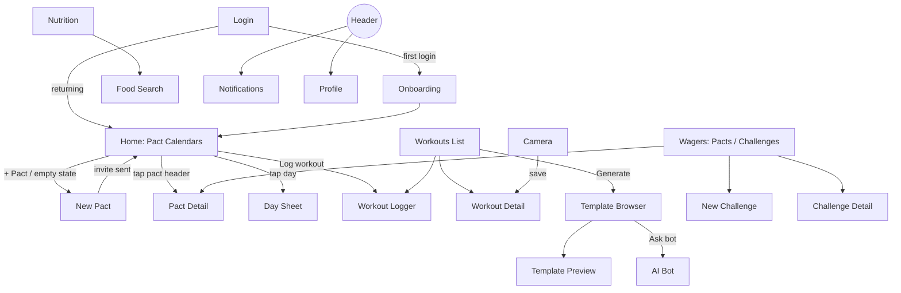

# App Flow

Every screen, how you reach it, what each control does, and where "back" goes.

## Map

Bottom nav (always visible in `/(app)`): Home · Workouts · Camera · Nutrition · Wagers.
Header (always visible): bell → Notifications, avatar → Profile.

## Auth
**Login** `/login`
- Email field + "Send magic link" → "Check your email" state + Resend (60s cooldown)
- "Continue with Google" / "Continue with GitHub" → OAuth → `/auth/callback`
- Callback: no profile row or `onboarded=false` → Onboarding, else Home
- Magic link fails/expired → error banner + suggest Google/GitHub

**Onboarding** `/onboarding` (one question per step, progress bar, Back on each step)
1. Name + @handle (live uniqueness check)
2. Training goal: Build muscle / Lose fat / Get stronger / Endurance
3. Body stats: weight, height, birth year, sex, activity level (skippable → no macro goals)
4. Track nutrition? yes/no → toggles Nutrition tab content
5. Partner: "Invite a partner now" → New Pact, or "Later" → Home
- Can't be skipped except step 3; on finish → Home

## Home `/home`
- **No pacts**: hero card "Train with someone" → New Pact; pending invites listed with Accept/Decline
- **Pacts**: one `WeekCalendar` per active pact (see 03_DESIGN_SYSTEM)
  - Tap header → Pact Detail
  - Tap day cell → Day Sheet (both partners' workouts that day; tap one → Workout Detail, own only gets Edit)
  - Swipe → previous weeks (read-only)
  - Last week's result banner until dismissed
- Primary button "Log workout" → Workout Logger
- Below: today's macros mini-card (if nutrition on) → Nutrition; active challenges strip → Challenge Detail

## Pacts
**New Pact** `/pacts/new`
- Search partner by @handle → select
- My weekly goal (1–7 days stepper) + stake text (suggestions: "Buy dinner", "Do the dishes", "Pick the movie")
- Send invite → `pact_invite` notification to partner → back to Home with "Invite sent"
- Back → Home

**Accepting**: Notification or Home invite card → sheet showing inviter, their goal + stake → set my own goal + stake → Accept (pact active) / Decline (inviter notified)
- Accepted after Monday → both partners see the `PactRulesBanner` on Home (Mon–Wed: this week counts; Thu–Sun: warm-up week, no stakes)

**Pact Detail** `/pacts/[id]`
- Current week calendar, streak, past weeks list (hit/missed per person)
- Ledger: "You owe Alex 2 dinners" / "Alex owes you 1 dishes" → Settle (creditor confirms) → `stake_settled`
- Settings: edit my goal/stake (applies next week), End pact (confirm dialog) → status ended, partner notified
- Back → Home

## Workouts
**List** `/workouts`: reverse-chronological, offline-pending items show a "Syncing" badge. Top buttons: "New" → Logger, "Generate" → Template Browser
**Logger** `/workouts/new`
- Name (or from template day), Add exercise → picker (search, muscle filter, add custom)
- Per set: reps, weight, RPE, ✓ complete; rest timer auto-starts on ✓
- "Add photo check-in" → Camera in check-in mode → returns with thumbnail
- Finish → save (online or queued) → Workout Detail; partner gets `partner_checkin`
- Leave with unsaved data → confirm dialog
**Detail** `/workouts/[id]`: sets table, media, notes, Edit / Delete (own only)

## Generator
**Template Browser** `/workouts/generate`: grid of templates → Preview (days, exercises, est. duration)
- "Use this program" → choose start date + weeks → creates planned workouts → Workouts List
- "Customize" → editable copy → Use
- "Export .docx / .xlsx" → client-side download
- "Ask the bot" → AI Bot
**AI Bot** `/workouts/generate/bot`: chat; replies can include "Export" buttons. Quota reached → disabled input + message.

## Camera `/camera`
- Permission prompt → live preview; denied → instructions screen + "Upload instead" (file input)
- Front/back toggle, Photo | Video pills
- Photo: shutter → preview → "Attach to workout" (picker: today's workouts or "new") / "Save to profile" / Retake
- Video: record (15s ring, auto-stop) → preview → caption field → save like photo
- Save result toast: "Uploaded" or "Stored on this device" + Export
- Opened from Logger (check-in mode): save returns straight to Logger

## Nutrition `/nutrition`
- Macro rings + calorie bar for selected day (date arrows, last 7 days)
- Meals grouped Breakfast/Lunch/Dinner/Snack; swipe entry → Edit / Delete
- "+" → Food Search: search seed + my foods → serving → meal type → Log
- "Describe it" (AI estimate, 5/day) → review values → Log
- "Create food" → form → saved to my foods

## Wagers `/wagers`
- Tab **Pacts**: all pacts + ledgers + Settle → Pact Detail
- Tab **Challenges**: active/pending/completed lists, "+" → New Challenge
- **New Challenge**: title, metric, target, dates, invite @handle → Send
- **Challenge Detail**: progress bars, chat, "Send gift" (catalog sheet → message → send; insufficient points → disabled with reason), Accept/Decline if pending

## Notifications `/notifications`
- List newest first; tap → deep link (pact, challenge, workout, profile gifts); mark all read
- Realtime toasts appear anywhere in `/(app)`

## Profile `/profile`
- Avatar, name, @handle, points, gifts received
- Edit stats/goals (recalculates macro goals, override allowed)
- Nutrition on/off, sign out, delete account (confirm; active pacts end, partners notified)
- Local media: count + "Export all"
- Install instructions (iOS)
